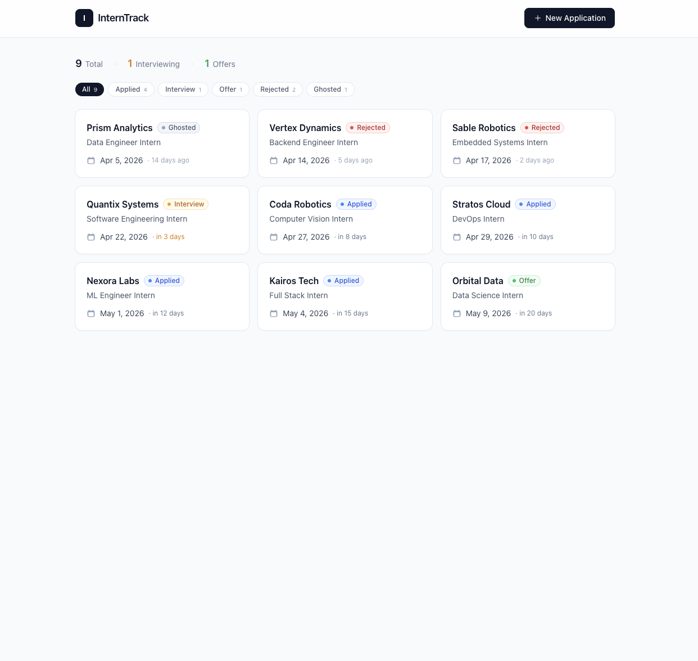

# InternTrack

A clean, minimal single-page app for tracking internship applications. Log each role you apply to, monitor deadlines at a glance, and keep notes as you move through the interview funnel. Data persists entirely in `localStorage` — no backend, no signup.

## Stack

- React 19 + TypeScript
- Vite
- Tailwind CSS

## Run locally

```bash
npm install
npm run dev
```

Build for production:

```bash
npm run build
```

## Live demo

https://intern-track-kuzey.netlify.app/

## Screenshot


